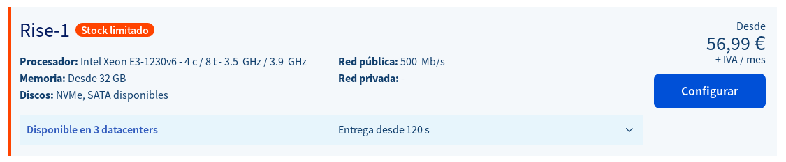
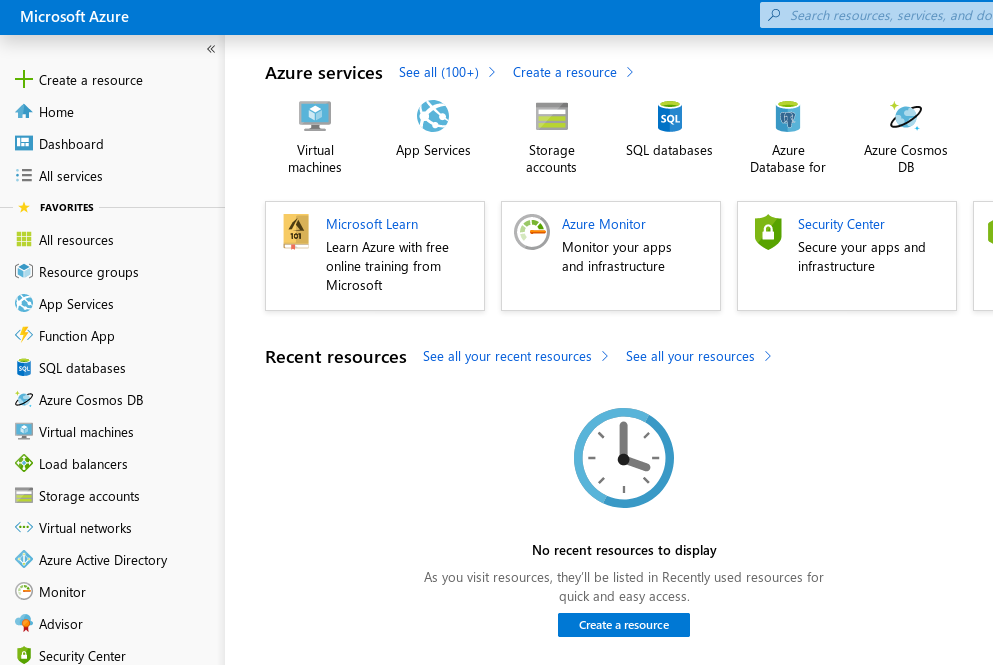

# Ejercicios Tema 1
## Introducción a la infraestructura virtual: concepto y soporte físico

### Ejercicio 1
La consulta se ha realizado en [Pccomponentes](https://www.pccomponentes.com/servidor-hp-proliant-ml110-gen10-intel-xeon-3106-16gb).


Para calcular el coste de amortización he seleccionado el precio sin IVA: 1057,02€.

1057,02 / (4*12) = 22,02€  
1057,02 / (7*12) = 12,58€

Por tanto, 

el coste de amortización mensual a 4 años es de __22,02€__.  
El coste de amortización mensual a 7 años es de __12,58€__.

### Ejercicio 2

La empresa OVH proporciona servidores dedicados físicos, el plan básico cuesta 56,99€ y proporciona un procesador  Intel Xeon E3-1230v6 con 4 núcleos y 8 hebras.



El precio por año de este servicio es: 683,88€ + IVA = __827.49€__

Para la alternativa cloud, he decidido escoger los servicios de Amazon AWS, los cuales proporcionan servicio de propósito general en la nube con 4 núcleos y 8 hebras llamado t3.2xlarge.
Al tratarse de un servicio por horas el cálculo del coste no es directo.
Si la infraestructura comprada se utiliza un 1% del tiempo y 1 año se compone de 8760 horas, el servicio se utilizaría 88 horas (recordar que se paga por horas, los decimales suman 1 hora extra). Si el servicio cuesta 0,34€ la hora, el coste por año sería __29,58€__.

Si la infraestructura comprada se utiliza un 10% d el tiempo, el servicio utilizaría 876 horas y por tanto su coste anual sería __297,84€__ al año.

| tipo \% de uso      |   1%    |   10%   |   50%   |
| ------------------- |:-------:| -------:| -------:|
| Servidor físico     | 827.49€ | 827.49€ | 827.49€ |
| Servidor en la nube | 29,58€  | 297,84€ | 1489,2€ |

Claramente si el servidor no tiene una carga importante de trabajo el servicio en la nube es mucho más rentable.

#### Ejercicio 3
El comando egrep `'^flags.*(vmx|svm)'` /proc/cpuinfo me muestra los flags, por tanto mi CPU tiene la virtualización hardware activada, el modelo es: Intel(R) Core(TM) i7-6700HQ CPU @ 2.60GHz.\
En la salida de la orden aparecen todos los flags activados de mi CPU (vmx siendo uno de ellos) y lo lista 8 veces, debido a que tengo 8 vCPU's.\
En una máquina virtual el comando no devuelve nada, aunque VirtualBox está trabajando para poder ofrecer virtualización anidada (_Nested Virtualization_) en un futuro.

### Ejercicio 4
mediante la orden `LC_ALL=C lscpu | grep Virtualization` he comprobado que mi procesador posee la aceleración hardware necesaria:\
`Virtualization:      VT-x`

He instalado KVM en mi distribución de linux (Fedora 64bits).\
Para comprobar que se ha instalado correctamente se puede ejecutar la siguiente orden que muestra si el módulo del kernel está cargado:

```bash
~ lsmod | grep kvm
kvm_intel             299008  0
kvm                   749568  1 kvm_intel
irqbypass              16384  1 kvm
```

### Ejercicio 5
Me he dado de alta en el servicio de Microsoft Azure, donde regalan 100€ en créditos para nuevos usuarios estudiantes.



### Ejercicio 6

Me he creado una cuenta en [openstack](https://www.openstack.org/).


