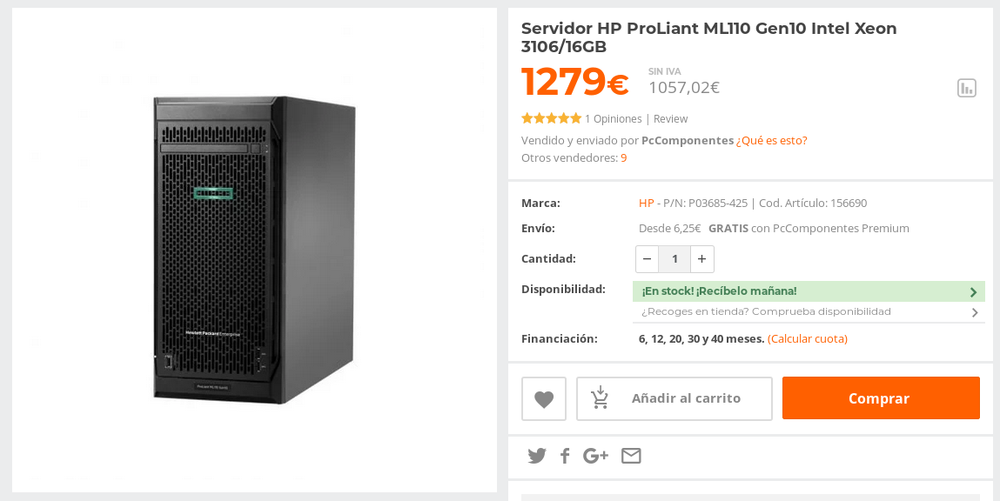

# Ejercicios Tema 1: Introducción a la infraestructura virtual: concepto y soporte físico

## Ejercicio 1
La consulta se ha realizado en [Pccomponentes](https://www.pccomponentes.com/servidor-hp-proliant-ml110-gen10-intel-xeon-3106-16gb).

Para calcular el coste de amortización he seleccioado el precio sin IVA: 1057,02€

1057,02 / (4*12) = 22,02€

1057,02 / (7*12) = 12,58€

Por tanto, 

el coste de amortización mensual a 4 años es de __22,02€__.

El coste de amortización mensual a 7 años es de __12,58€__.

