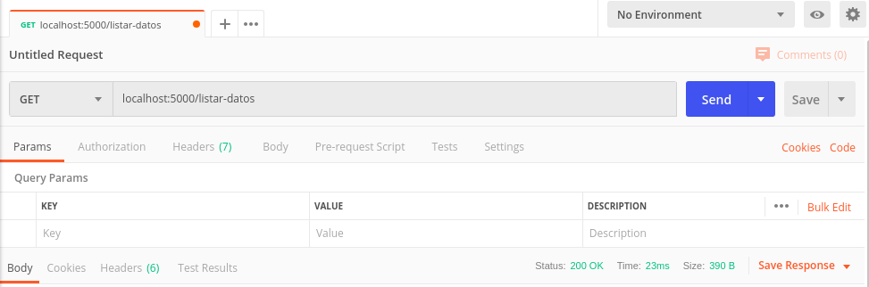
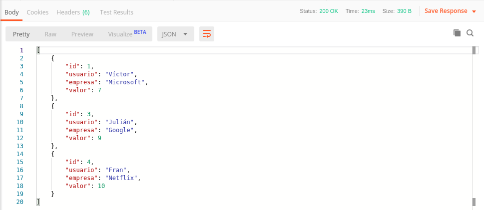

# Ejercicios Tema 2
## Desarrollo basado en pruebas

## Ejercicio 3
He creado tests para Ruby con RSpec, en concreto para comprobar el resultado de una función que calcula el máximo común divisor mediante el algoritmo de Euclides. 

Como dicta el desarrollo basado en pruebas, lo primero es realizar los tests que queremos aplicar:

```
require 'euclides'

RSpec.describe "#mcd" do
    it "should calculate the mcd of the given numbers" do
        res = mcd(1032,180)
        expect(res).to eq 12
    end

    it "should work if the first number is bigger than the second one" do
        res = mcd(180,1032)
        expect(res).to eq 12
    end
end
```

A continuación, se desarrolla el programa en cuestión:

```
def mcd(x,y)
    resto = 1
    cociente = 0
    mcd = nil

    while resto != 0 do
        # división entera
        cociente = x / y
        resto    = x % y

        # si el resto es 0, hemos encontrado el mcd
        if resto == 0 then
            mcd = y
        else
            x = y
            y = resto
        end
    end

    return mcd
end
```

Al ejecutar la prueba, la salida es:

```
#mcd
  should calculate the mcd of the given numbers
  should work if the first number is bigger than the second one

Finished in 0.00132 seconds (files took 0.07969 seconds to load)
2 examples, 0 failures
```

Vamos a añadir una nueva prueba para comprobar si la función maneja correctamente que introduzcamos otros tipos de datos:

```
    it "should fail if x or y are not integers" do
        res = mcd("a","b")
        expect(res). to eq "arguments must be integers"
    end
```

Si volvemos a ejecutar la prueba...

```
#mcd
  should calculate the mcd of the given numbers
  should work if the first number is bigger than the second one
  should fail if x or y are not integers (FAILED - 1)

Failures:

  1) #mcd should fail if x or y are not integers
     Failure/Error: cociente = x / y
     
     NoMethodError:
       undefined method `/' for "a":String
     # ./lib/euclides.rb:8:in `mcd'
     # ./spec/euclides_spec.rb:15:in `block (2 levels) in <top (required)>'

Finished in 0.00295 seconds (files took 0.08598 seconds to load)
3 examples, 1 failure

Failed examples:

rspec ./spec/euclides_spec.rb:14 # #mcd should fail if x or y are not integers
```

Dado que el test ha fallado ahora añadimos esa funcionalidad:

```
    if(x.is_a? Integer and y.is_a? Integer) then
```
Y ahora sí, nuestro test es un éxito!

```
#mcd
  should calculate the mcd of the given numbers
  should work if the first number is bigger than the second one
  should fail if x or y are not integers

Finished in 0.0014 seconds (files took 0.07683 seconds to load)
3 examples, 0 failures
```

Todo el código de este ejercicio se puede ver [aquí](https://github.com/victorperalta93/IV-Ejercicios/blob/master/t2/ejercicio3)

## Ejercicio 4 
Una vez instalado nvm, podemos ejecutar `nvm ls-remote` en la linea de comandos para ver todas las versiones disponibles.
La última versión es la `v12.11.1` a día 9 de Octubre de 2019. Para instarlarla, basta con ejecutar: `nvm install v12.11.1`, lo cual genera la siguiente salida:

```
Downloading and installing node v12.11.1...
Downloading https://nodejs.org/dist/v12.11.1/node-v12.11.1-linux-x64.tar.xz...
Computing checksum with sha256sum
Checksums matched!
Now using node v12.11.1 (npm v6.11.3)
Creating default alias: default -> v12.11.1
```

Para instalar la versión v4.9.1, basta con ejecutar `nvm install v4.9.1`:

```
Downloading and installing node v4.9.1...
Downloading https://nodejs.org/dist/v4.9.1/node-v4.9.1-linux-x64.tar.xz...
Computing checksum with sha256sum
Checksums matched!
Now using node v4.9.1 (npm v2.15.11)
```

Para probar esta funcionalidad, he decidido utilizar el método `hasColors` de `WriteStream` para la terminal de texto (tty). Este método fue [añadido](https://nodejs.org/es/blog/release/v11.13.0/) a la versión v11.13.0. Por tanto si lo ejecuto con una versión igual o superior debería funcionar.

Ejecuto `nvm use v12.11.1` para cambiar a dicha versión y `node ttycolors.js` para ejecutar mi programa, lo que devuelve:
```
true
```
Si cambio a la versión v4.9.1 con `nvm use v4.9.1` obtengo la siguiente salida:

```
console.log(process.stdout.hasColors());
                           ^

TypeError: process.stdout.hasColors is not a function
    at Object.<anonymous> (ttycolors.js:4:28)
    at Module._compile (module.js:409:26)
    at Object.Module._extensions..js (module.js:416:10)
    at Module.load (module.js:343:32)
    at Function.Module._load (module.js:300:12)
    at Function.Module.runMain (module.js:441:10)
    at startup (node.js:140:18)
    at node.js:1043:3
```
Indicando que la función no existe!

## Ejercicio 5

He desarrollado la aplicación en node.js con express.js como microframework y sqlite3 para la base de datos. Así me sirve para una toma de contacto de cara a mi proyecto de la asignatura.
He creado un repositorio nuevo ya que se pretende utilizar el mismo ejemplo para temas posteriores, lo puedes encontrar [aquí](https://github.com/victorperalta93/califica-empresas).

He implementado las peticiones básicas que aparecen en la descripción del ejercicio, para ponerlas a prueba he utilizado [Postman](https://www.getpostman.com/).

Para describir cómo funciona el programa, vamos a seguir alguna de las peticiones implementadas, en concreto: `listar calificaciones`.
Primero, enviamos la petición con postman:



A continuación, el servidor recibe la petición:

```
app.get('/listar-datos',(req,res) =>{
    calif.getAll(function(tabla){
        res.send(tabla)
    });
});
```
Y realiza la petición a la base de datos.
> Nota: callback sirve para recibir la respuesta de la base de datos, ya que la petición es asíncrona.


```
getAll(callback){
    this.db.conn.all('SELECT * FROM calificaciones',(err, rows) => {
        if (err) 
            throw err;
        else
            return callback(rows);
    });
}
```
Por último, Postman nos muestra el resultado: 



El resto de peticiones se tratan de forma similar, para ver el código completo dirígete a su [repositorio](https://github.com/victorperalta93/califica-empresas).

## Ejercicio 6

Primero, podemos utilizar `nvm ls` para ver que versión de node estamos utilizando y las disponibles en el proyecto:

```
$:nvm ls
         v4.9.1
       v12.11.1
->     v10.16.3
```

La versión actual es `v10.16.3` y la ejecución con ella no da ningún problema:

```
$:npm run dev   

> califica-empresas@1.0.0 dev 
> nodemon server.js

[nodemon] 1.19.3
[nodemon] to restart at any time, enter `rs`
[nodemon] watching dir(s): *.*
[nodemon] watching extensions: js,mjs,json
[nodemon] starting `node server.js`
Servidor iniciado en puerto: 5000
Conexión establecida con la base de datos.
```

> Nota: nodemon reinicia el servidor automaticamente cada vez que se actualiza alguno de sus archivos fuente. ¡Muy Util!

Probemos ahora con la versión `v12.11.1`:

```
$:nvm use v12.11.1
Now using node v12.11.1 (npm v6.11.3)
$:npm run dev     

> califica-empresas@1.0.0 dev
> nodemon server.js

[nodemon] 1.19.3
[nodemon] to restart at any time, enter `rs`
[nodemon] watching dir(s): *.*
[nodemon] watching extensions: js,mjs,json
[nodemon] starting `node server.js`
internal/modules/cjs/loader.js:783
    throw err;
    ^

Error: Cannot find module '/home/victorperalta/Dropbox/Ingenieria Informatica/IV/Practicas/califica-empresas/node_modules/sqlite3/lib/binding/node-v72-linux-x64/node_sqlite3.node'

[nodemon] app crashed - waiting for file changes before starting...
```

Curiosamente, con una versión superior, ¡nuestro servidor no inicia!  
Por estas cosas es tan valioso un gestor de versiones.

## Ejercicio 7

Para crear un `package.json` en nuestro proyecto basta con ejecutar `npm init` y se creará un archivo con las opciones básicas. A partir de aquí, cada vez que se utilice `npm install` se añadirá automaticamente una dependencia. Mi `package.json` del ejercicio 5 es el siguiente:

```
{
  "name": "califica-empresas",
  "version": "1.0.0",
  "description": "Pequeño servicio web como parte de los ejercicios de la asignatura Infraestructura Virtual (19-20)",
  "main": "index.js",
  "scripts": {
    "start": "node server.js",
    "dev": "nodemon server.js"
  },
  "repository": {
    "type": "git",
    "url": "git+https://github.com/victorperalta93/califica-empresas.git"
  },
  "author": "Victor Peralta",
  "license": "GPL-3.0",
  "bugs": {
    "url": "https://github.com/victorperalta93/califica-empresas/issues"
  },
  "homepage": "https://github.com/victorperalta93/califica-empresas#readme",
  "dependencies": {
    "express": "^4.17.1",
    "sqlite": "^3.0.3"
  },
  "devDependencies": {
    "nodemon": "^1.19.3"
  }
}
```
Tiene como dependencias [express](https://expressjs.com/es/) y [sqlite](https://www.sqlite.org/index.html). Tambien aparece [nodemon](https://nodemon.io/) como depedencia de desarrollo, esto es útil cuando existen dependencias que solo son necesarias para el proceso de desarrollo, para añadir una dependencia de desarrollo se utiliza `npm install [paquete] --save-dev`.