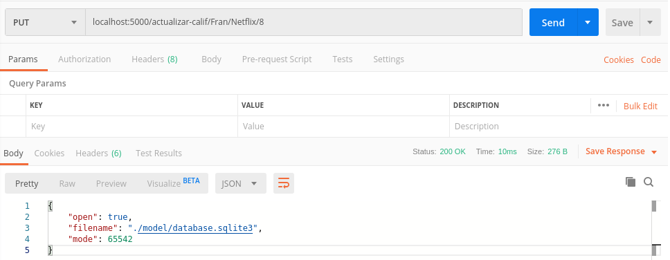
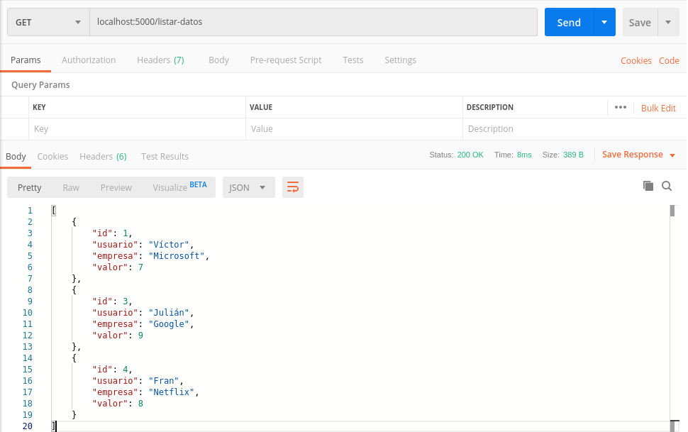

# Ejercicios Tema 3
## Puesta en marcha de microservicios

## Ejercicio 1
Durante los ejercicios del tema anterior aproveché para familiarizarme con Express y desarrollé la aplicación `califica-empresas` con una API REST directamente. Algunas de las llamadas que implementé se corresponden con lo que se pide en este ejercicio. Por ejemplo:

```
app.get('/listar-empresas',(req,res) =>{
    empr.getAll(function(tabla){
        res.send(tabla)
    });
});

```

En el ejercicio 5 del [tema 2](https://github.com/victorperalta93/IV-Ejercicios/blob/master/tema2.md) se puede ver más información sobre como implementé este tipo de llamadas.

## Ejercicio 2
Mi aplicación `califica-empresas` no tiene ninguna petición en la que los datos de envío vienen incluidos en la dirección de la petición. Por tanto, voy a implementar una petición nueva y probar esta funcionalidad:

```
app.put('/actualizar-calif/:usuario/:empresa/:valor', (req,res) =>{
    res.send(calif.actualizar(req.params.usuario,req.params.empresa,req.params.valor))
})
```

Una vez recibida la petición, se ejecuta la siguiente función:

```
actualizar(usuario,empresa,valor){
    return this.db.conn.run('UPDATE calificaciones SET valor=? WHERE usuario=? AND empresa=?',[valor,usuario,empresa,],(err) =>{
                    if(err)
                        throw err
                    })
}
```

Probemos ahora la nueva funcionalidad, el estado actual de la base de datos es:

```
[
    {
        "id": 1,
        "usuario": "Víctor",
        "empresa": "Microsoft",
        "valor": 7
    },
    {
        "id": 3,
        "usuario": "Julián",
        "empresa": "Google",
        "valor": 9
    },
    {
        "id": 4,
        "usuario": "Fran",
        "empresa": "Netflix",
        "valor": 10
    }
]
```

Podemos utilizar la siguiente dirección para realizar la petición: `localhost:5000/actualizar-calif/Fran/Netflix/10`



El servidor nos devuelve `Status: 200 OK`. Si ahora volvemos a consultar la base de datos:



## Ejercicio 3
las pruebas creadas para las rutas de mi aplicación están en el archivo: [server.test.js](https://github.com/victorperalta93/califica-empresas/blob/master/test/server.test.js).

```
var request = require('supertest');
app = require('../server.js');

describe("POST empresa", function(){
    it('deberia añadir una nueva empresa', function(done){
        request(app)
            .post('/empresa/nombre')
            .expect('Content-Type',/json/)
            .expect(200,done);
    });
});

describe("GET empresas", function(){
    it('deberia recibir una lista de las empresas', function(done){
        request(app)
            .get('/empresas')
            .expect('Content-Type',/json/)
            .expect(200,done);
    });

    it('deberia recibir todos los datos almacenados', function(done){
        request(app)
            .get('/datos')
            .expect('Content-Type',/json/)
            .expect(200,done);
    });
});

describe("POST calificacion", function(){
    it('deberia añadir una nueva calificación', function(done){
        request(app)
            .post('/calificacion/Juan/Northgate-Arinso/6')
            .expect('Content-Type',/json/)
            .expect(200,done);
    });
});

describe("PUT calificacion", function(){
    it('deberia actualizar una calificación existente', function(done){
        request(app)
            .put('/calificacion/Juan/Northgate-Arinso/8')
            .expect('Content-Type',/json/)
            .expect(200,done);
    });
});

describe("DELETE calificacion", function(){
    it('deberia eliminar una calificación existente', function(done){
        request(app)
            .delete('/calificacion/1')
            .expect('Content-Type',/json/)
            .expect(200,done);
    });
});

```

Una vez terminadas, basta con añadir una linea de test al `package.json` y ejecutarlo.

```
> califica-empresas@1.0.0 test /home/victorperalta/Dropbox/Ingenieria Informatica/IV/Practicas/califica-empresas
> mocha


Servidor iniciado en puerto: 5000
Conexión establecida con la base de datos.
  POST empresa
    ✓ deberia añadir una nueva empresa

  GET empresas
    ✓ deberia recibir una lista de las empresas
    ✓ deberia recibir todos los datos almacenados

  POST calificacion
    ✓ deberia añadir una nueva calificación

  PUT calificacion
    ✓ deberia actualizar una calificación existente

  DELETE calificacion
    ✓ deberia eliminar una calificación existente


  6 passing (65ms)
  ```