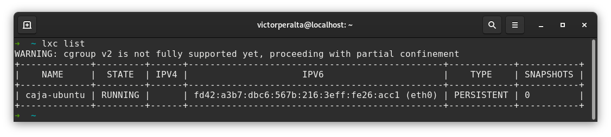
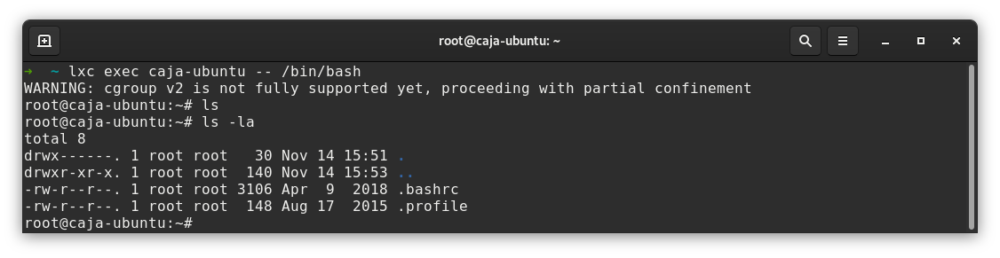
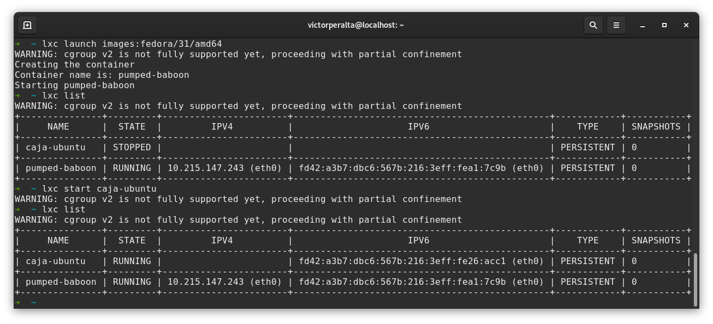

# Ejercicios Tema 4
## Virtualización _ligera_ usando contenedores

## Ejercicio 1
Se propone instalar [LXC](https://linuxcontainers.org/lxc/) en nuestra versión de Linux favorita. En mi caso, esto quiere decir instalar el software en Fedora 31. Para ello la [wiki](https://fedoraproject.org/wiki/LXC) de Fedora nos facilita la instalación ejecutando lo siguiente:

```
# dnf install lxc lxc-templates
```

La comprobación de la versión instalada se realiza de la siguiente forma:

```
lxc-ls --version
```

En mi caso instalé la versión _3.0.4_. Se recomienda instalar la última versión disponible y asegurarnos de que sea mayor que la versión _1.0_.  
A fecha de 22 de Noviembre de 2019, la versión más actual es la _3.2.1_, pero ya que supero la versión _1.0_ con creces, prefiero tener instalada la versión disponible en el gestor de paquetes de Fedora.

## Ejercicio 2
Tras varias horas intentando que LXC me funcionase decidí probar a utilizar LXD (que es una nueva versión ofreciendo LXC con una interfaz más amigable). Para instalar LXD puedes dirigirte a su guía de introducción y elegir la opción de tu distribución linux. 
Una vez instalado, debes realizar la configuración de inicio:
```
lxc init
```

Una vez configurado puedes crear y ejecutar un contenedor:
```
lxc launch ubuntu:18.04 caja-ubuntu
```

Puedes mostrar el estado de los contenedores de esta forma:


Es posible arrancar una terminal bash en el contenedor:


El ejercicio pide instalar 2 contenedores, uno utilizando la misma distribución que el host (Fedora) y otro utilizando cualquier otra distribución (en mi caso Ubuntu). Por tanto el siguiente paso es instalar un contenedor que utilice Fedora como distribución:



Por último, podemos eliminar los contenedores:

```
lxc stop caja-ubuntu --force
lxc stop pumped-baboon --force
lxc delete caja-ubuntu pumped-baboon
```

Por alguna razón no me dejaba detener los contenedores sin utilizar `--force`.