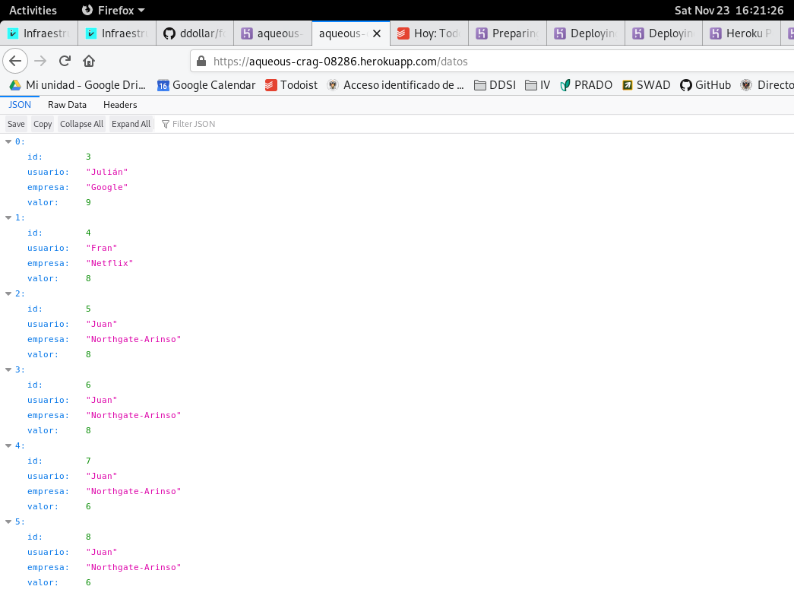
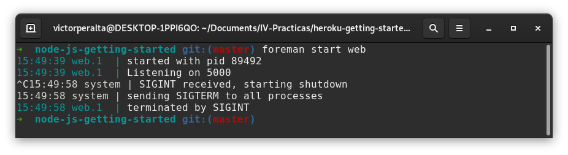

# Ejercicios Tema 4
## Desplegando aplicaciones en la nube: Uso de PaaS

## Ejercicio 1
Para este ejercicio voy a darme de alta en [Heroku](https://www.heroku.com). Proceso habitual para darse de alta en una plataforma, una vez introducidos los datos heroku nos da la bienvenida:


A continuación es posible verificar la cuenta de estudiante para beneficiarnos del paquete de estudiante de GitHub:


Una vez hecho esto, nuestra cuenta estará verificada y lista para usar!


## Ejercicio 2
He realizado un despliegue de prueba en Heroku, para ello nos proporcionan un tutorial para los lenguajes más utilizados (en mi caso NodeJS). Puedes ver el tutorial en [este enlace](https://devcenter.heroku.com/articles/getting-started-with-nodejs).

En el tutorial enseñan a desplegar una aplicación, cambiar su configuración, configurar un sistema de logs, escalar la aplicación y añadir _add-ons_ a la misma.

La aplicación desplegada se puede ver en el siguiente enlace:

>[https://aqueous-caverns-12877.herokuapp.com/](https://aqueous-caverns-12877.herokuapp.com/)

Tiene las siguientes rutas configuradas:

* __/__ : página principal de la aplicación
* __/cool__: muestra una cara aleatoria en formato ASCII
* __/times__: muestra una serie de números controlados por una variable de entorno
* __/db__: muestra información de una tabla en PostgreSQL


## Ejercicio 3 
Para este ejercicio voy a desplegar la aplicación desarrollada a lo largo del temario de teoría de la asignatura `califica-empresas`. Para ello hay que seguir los siguientes pasos:

1. Añadir repositorio remoto de Heroku
```
heroku create
```

2. Añadir un `Procfile`, en mi caso su contenido es el siguiente:

```
web: node server.js
```

3. Añadir la versión de node en `package.json`:

```
  "engines": {
    "node": "12.13"
  },
```

4. Desplegar el código
```
git add .
git commit -m "Añadido Procfile y versión de node"
git push heroku master
```

Una vez hecho esto basta con acceder a la dirección del servicio para comprobar que funciona correctamente:




## Ejercicio 4
Primero hay que instalar foreman:

```
gem install foreman
```

Una vez instalado se puede lanzar la aplicación en local con `foreman start web`:


Me gustaría añadir que heroku también incluye la capacidad de lanzar tu web de forma local:

```
heroku local
```
