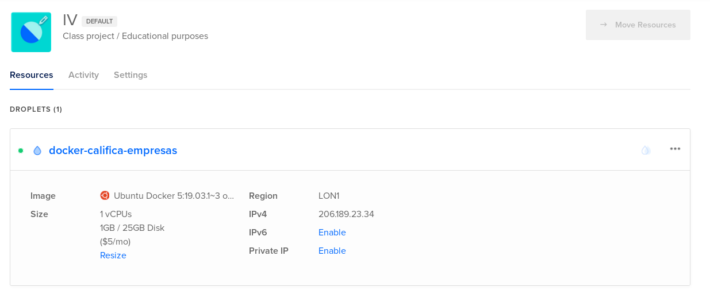

# Ejercicios Tema 5
## Virtualización _ligera_ usando contenedores

## Ejercicio 1
Se propone instalar [LXC](https://linuxcontainers.org/lxc/) en nuestra versión de Linux favorita. En mi caso, esto quiere decir instalar el software en Fedora 31. Para ello la [wiki](https://fedoraproject.org/wiki/LXC) de Fedora nos facilita la instalación ejecutando lo siguiente:

```
# dnf install lxc lxc-templates
```

La comprobación de la versión instalada se realiza de la siguiente forma:

```
lxc-ls --version
```

En mi caso instalé la versión _3.0.4_. Se recomienda instalar la última versión disponible y asegurarnos de que sea mayor que la versión _1.0_.  
A fecha de 22 de Noviembre de 2019, la versión más actual es la _3.2.1_, pero ya que supero la versión _1.0_ con creces, prefiero tener instalada la versión disponible en el gestor de paquetes de Fedora.

## Ejercicio 2
Tras varias horas intentando que LXC me funcionase decidí probar a utilizar LXD (que es una nueva versión ofreciendo LXC con una interfaz más amigable). Para instalar LXD puedes dirigirte a su guía de introducción y elegir la opción de tu distribución linux. 
Una vez instalado, debes realizar la configuración de inicio:
```
lxc init
```

Una vez configurado puedes crear y ejecutar un contenedor:
```
lxc launch ubuntu:18.04 caja-ubuntu
```

Puedes mostrar el estado de los contenedores de esta forma:


Es posible arrancar una terminal bash en el contenedor:


El ejercicio pide instalar 2 contenedores, uno utilizando la misma distribución que el host (Fedora) y otro utilizando cualquier otra distribución (en mi caso Ubuntu). Por tanto el siguiente paso es instalar un contenedor que utilice Fedora como distribución:


Por último, podemos eliminar los contenedores:

```
lxc stop caja-ubuntu --force
lxc stop pumped-baboon --force
lxc delete caja-ubuntu pumped-baboon
```

Por alguna razón no me dejaba detener los contenedores sin utilizar `--force`.

## Ejercicio 3
La instalación de Docker para Fedora tiene los siguientes pasos:
1. Instala el paquete necesario para organizar tus repositorios en DNF:
   ```
    $ sudo dnf -y install dnf-plugins-core
   ```
2. Añade el repositorio __stable__:
   ```
   $ sudo dnf config-manager \
    --add-repo \
    https://download.docker.com/linux/fedora/docker-ce.repo
   ```
3. Instala _Docker Community_
   ```
    $ sudo dnf install docker-ce docker-ce-cli containerd.io
   ```

Una vez instalado tendrás que activar el servicio de Docker:
```
$ sudo systemctl start docker
```

Puedes utilizar el siguiente comando para comprobar que Docker funciona correctamente:
```
$ sudo docker run hello-world
```

> __Nota para usuarios de Fedora 31__  
> Si eres tan impaciente como yo y has tomado la dudable decisión de actualizar la versión de Fedora en mitad del curso universitario, necesitarás dar un paso extra para que Docker funcione correctamente ya que Fedora 31 ahora utiliza `cgroupsV2` por defecto y no está aún soportado en Docker, por tanto debes desactivarlo.
> ```
> sudo grubby --update-kernel=ALL --args="systemd.unified_cgroup_hierarchy=0"
> ```
> Tras ejecutar el comando debes reiniciar la máquina. Puedes encontrar más información en [este issue](https://github.com/docker/cli/issues/297).

## Ejercicio 4
Se propone instalar varias imágenes de Docker, en este ejercicio voy a mostrar 2 imágenes que se pueden encontrar en [Docker Hub](https://hub.docker.com/).

Primero se propone instalar alguna imagen disponible de Ubuntu, en mi caso he elegido [ceregousa/ubuntu-git](https://hub.docker.com/r/ceregousa/ubuntu-git), dicha imagen ofrece un contenedor con Ubuntu y git instalado.

Para descargar el contenedor:

```
sudo docker pull ceregousa/ubuntu-git
```

A continuación muestro una pequeña interacción con el contenedor para comprobar que git funciona correctamente:


CentOS distribuye una imagen oficial en Docker Hub y por tanto voy a utilizar esa.

```
sudo docker pull centos
```

Se puede arrancar una terminal en el contenedor y comprobar la versión de CentOS:
 


Por último se propone buscar e instalar una imagen que incluya MongoDB, igual que con CentOS, el equipo de MongoDB provee una imagen oficial.

```
sudo docker pull mongo
```

Parece que nos ofrecen la versión 4.2.1 de MongoDB en un contenedor Linux con Debian Buster:


Para probar a entrar en el shell de mongo primero hay que arrancar el contenedor:

```
sudo docker run -it -p 28000:27017 --name mongodock mongo
```

A continuación abrimos un shell:

```
sudo docker exec -it mongodock mongo
```


## Ejercicio 5
Primero, hay que ejecutar un _shell_ en el contenedor de ubuntu.

```
sudo docker run -i -t ubuntu /bin/bash
```

El ejercicio propone añadir un usuario:


Para instalar Nginx primero hay que actualizar el contenedor para que detecte el paquete:

```
apt-get update
apt-get upgrade
```

Por último se instala nginx

```
apt-get install nginx
```


## Ejercicio 6
Para crear una imagen persistente de un contenedor se utiliza `docker commit`.
```
sudo docker commit ID-CONTENEDOR nuevo-nombre
```

He realizado un commit del contenedor del ejercicio anterior con nginx instalado.


## Ejercicio 7
He creado un Dockerfile para mi aplicación [califica-empresas](https://github.com/victorperalta93/califica-empresas).

```
FROM node

WORKDIR /califica-empresas

COPY package*.json ./

RUN npm install

COPY . .

EXPOSE 5000

CMD ["npm","start"]
```
Este Dockerfile sigue los siguientes pasos:
1. Utiliza el contenedor oficial de nodeJS
2. La aplicación se copia en el directorio `/califica-empresas`
3. Se instalan las dependencias de la aplicación
4. Se copia todo el contenido del directorio de la aplicación al directorio de trabajo del contenedor
5. Se define el puerto en el que la aplicación del contenedor va a escuchar, en mi caso puerto 5000
6. Se ejecuta `npm start` para arrancar el servicio

Una vez definido el `Dockerfile` en el directorio de la aplicación hay que construir la imagen.

```
sudo docker image build -t victorperalta93/califica-empresas .
```

Al arrancar la imagen es importante definir `-p 80:5000` que hará que el puerto 5000 del contenedor se redirija al puerto 80 del host.

```
sudo docker container run -it -p 80:5000 victorperalta93/califica-empresas
```

En `localhost` deberiamos poder acceder al servicio:


## Ejercicio 8
He creado un nuevo contenedor en [DockerHub](https://hub.docker.com) que se construye automáticamente cada vez que el repositorio del proyecto en GitHub se actualiza.


He creado un droplet en [DigitalOcean](https://www.digitalocean.com/) para alojar el contenedor de Docker. 



Una vez creado he accedido al servidor por SSH con la IPv4 que proporcionan, he clonado el repositorio de git y he arrancado el contenedor.


Por último, si accedemos a la ip del servidor deberíamos poder utilizar el servicio.

