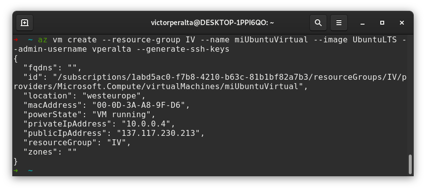
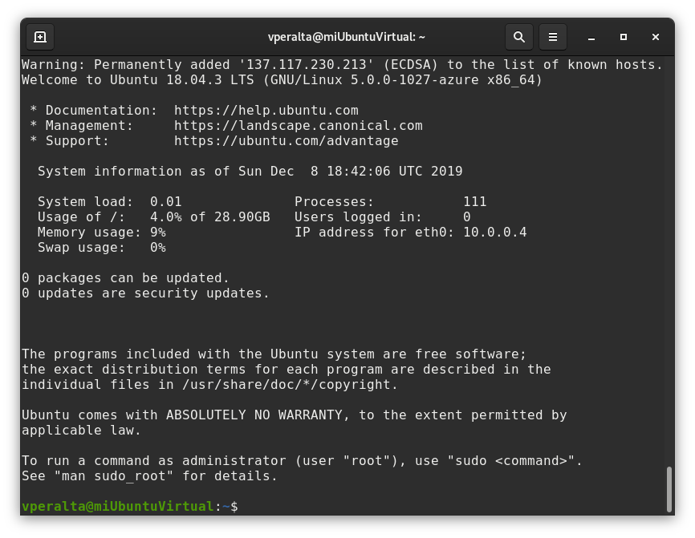
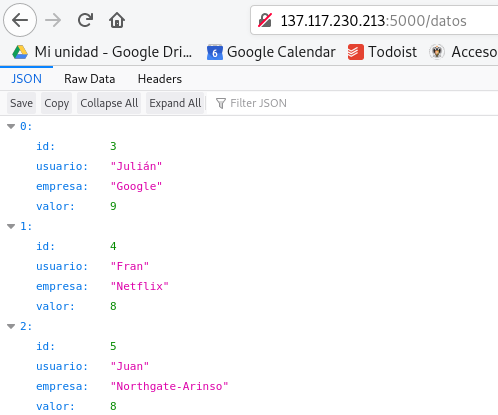
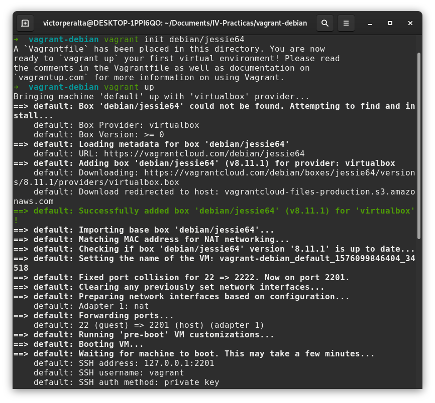
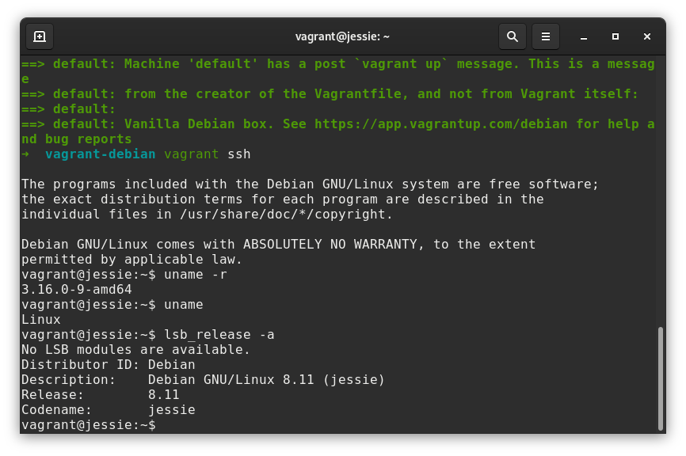

# Ejercicios Tema 6
## Gestión de infraestructuras virtuales

## Ejercicio 1
He instalado una máquina virtual de Ubuntu en Azure y he desplegado la aplicación `califica-empresas` en la misma. Los pasos seguidos han sido los siguientes:

1. Creación de la máquina virtual:
   ```
    az vm create --resource-group IV --name miUbuntuVirtual --image UbuntuLTS --admin-username vperalta --generate--ssh-keys
   ```
   Se han indicado los siguientes parámetros:
    * Nombre del grupo de recursos: IV
    * Nombre de la máquina virtual: miUbuntuVirtual
    * Nombre de la imagen a utilizar: UbuntuLTS (a fecha de Diciembre de 2019 ésto corresponde a la versión 18.04.3 de Ubuntu)
    * Nombre del usuario administrador: vperalta
    * `--generate--ssh-keys` para generar claves SSH y poder conectar fácilmente con la máquina.

    Una vez creada debería aparecernos un mensaje similar al siguiente:

    

2. Conectar por SSH a la máquina virtual:
   ```
   ssh vperalta@137.117.230.213
   ```
    

3. Clonar el repositorio de la aplicación, instalar npm y las dependencias de la aplicación:
   ```
   git clone git@github.com:victorperalta93/califica-empresas.git
   sudo apt install npm
   npm install
   ```
4. Abrir puerto 5000 para poder acceder a la aplicación:
   ```
    az vm open-port --port 5000 --resource-group IV --name miUbuntuVirtual
   ```

5. Al lanzar la aplicación, se debería poder acceder a ella mediante la IP pública que provee Azure y el puerto donde se lanza:

    

6. Recuerda parar la VM cuando hayas terminado:
    ```
    az vm stop --name miUbuntuVirtual --resource-group IV
    ```
7. Para eliminar la máquina virtual del grupo de recursos y así evitar cargos ejecuta:
   ```
    az vm deallocate --name miUbuntuVirtual --resource-group IV
   ```

He seguido [este tutorial](https://docs.microsoft.com/es-es/azure/virtual-machines/linux/quick-create-cli) para realizar este ejercicio.

## Ejercicio 4
Se propone instalar una máquina virtual Debian utilizando Vagrant, para ello hay que seguir los siguientes pasos:
1. Crear el `Vagrantfile`:
    ```
    vagrant init debian/jessie64
    ```
2. Lanzar la máquina virtual:
    ```
    vagrant up
    ```

Los pasos anteriores se muestran en la siguiente captura:



3. Por último, para conectar con la máquina:
   ```
    vagrant ssh
   ```

La siguiente captura muestra la conexión por ssh y la versión de Debian instalada:
